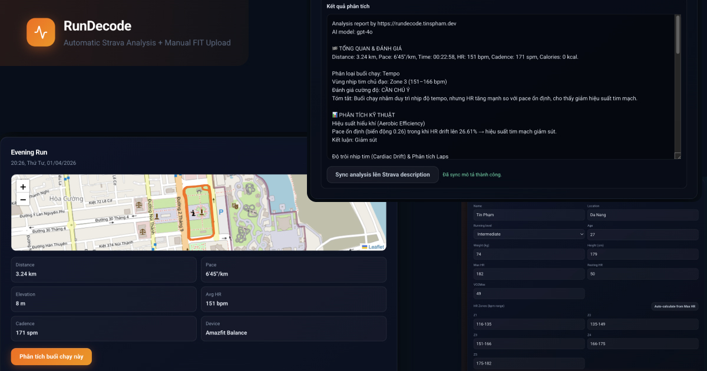

# RunDecode

RunDecode is a Next.js app for AI-Powered Running Analysis for Strava or FIT Workouts

RunDecode helps runners analyze Strava activities or FIT uploads with Vietnamese AI insights, clear performance context, and fast copy/sync workflow.

Start with Strava for quick activity analysis, or switch to manual FIT upload when needed.




---

## What the app does now

### Strava-first flow

- Connect with Strava OAuth
- Fetch recent supported activities only
- MVP allowlist: `Run`, `Walk`, `Hike/Hiking`, `Trail/TrailRun`
- Show activity cards with:
  - route map (when polyline exists)
  - metrics
  - current Strava description
  - per-activity AI analysis result
- Sync generated analysis back into the Strava activity description

### Manual FIT flow

- Available on `/manual`
- Accepts `.fit` files only
- Parse-preview before analysis
- User verifies metadata first
- User chooses a model from the free model list
- User runs analysis only after preview succeeds

---

## Current tech stack

- **Framework:** Next.js 14 App Router + TypeScript
- **UI:** React 18 + Tailwind CSS + custom UI primitives
- **Forms/Upload:** react-hook-form + react-dropzone
- **State:** Zustand
- **Maps:** react-leaflet + leaflet + @mapbox/polyline
- **Toasts:** react-hot-toast
- **FIT parsing:** fit-file-parser
- **AI provider:** OpenRouter SDK
- **Tests:** Vitest + Testing Library

---

## AI setup

Source of truth: `lib/aiAnalyzer.ts`

- Provider: OpenRouter
- Analysis method: `generateAnalysis(...)`
- Prompt source: `src/prompts/runAnalysisSystemPrompt.ts`
- Prompt assembly: `lib/buildPromptContext.ts`

Current free-model list is defined in `FREE_MODELS` and the **default model is the first item in that array**.

---

## Environment variables

Create `.env` or `.env.local`:

```env
OPENROUTER_API_KEY=your_openrouter_key
STRAVA_CLIENT_ID=your_strava_client_id
STRAVA_CLIENT_SECRET=your_strava_client_secret
STRAVA_REDIRECT_URI=http://localhost:3000/api/strava/callback
```

Notes:

- `OPENROUTER_API_KEY` is required for both FIT and Strava analysis
- Strava secrets must remain server-side only

---

## Local development

Install dependencies:

```bash
pnpm install
```

Run dev server:

```bash
pnpm dev
```

Run tests:

```bash
pnpm test
```

Build production:

```bash
pnpm build
pnpm start
```

---

## Route overview

### App routes

- `/` → Strava-first experience
- `/manual` → manual FIT upload experience

### API routes

- `POST /api/parse-fit`
- `POST /api/analyze-fit`
- `POST /api/analyze-strava`
- `GET /api/strava/auth-url`
- `GET /api/strava/callback`
- `POST /api/strava/refresh`
- `GET /api/strava/activities`
- `GET /api/strava/streams`
- `GET /api/strava/athlete-stats`
- `POST /api/strava/activity-description`

---

## Privacy and MVP rules

- `.fit` uploads must pass extension + MIME + FIT signature validation
- Upload limit remains `<= 4MB`
- Do not send GPS traces to AI
- Do not send raw device identifiers to AI
- Only analyze supported MVP activity types from Strava

---

## Project map

```text
app/
  api/
    analyze-fit/
    analyze-strava/
    parse-fit/
    strava/
  manual/
    page.tsx
  page.tsx

components/
  ActivityCard.tsx
  ActivityList.tsx
  ActivityRouteMap.tsx
  AnalysisDisplay.tsx
  AthleteProfileForm.tsx
  ErrorAlert.tsx
  FitUploadPanel.tsx
  LoadingSpinner.tsx
  MetadataSidebar.tsx
  StravaPanel.tsx

lib/
  aiAnalyzer.ts
  buildPromptContext.ts
  fitParser.ts
  fitUploadValidation.ts
  stravaActivityExtractor.ts
  stravaAuth.ts
  stravaContextBuilder.ts
  stravaTypes.ts

stores/
  analysisStore.ts
  authStore.ts
  profileStore.ts
  stravaStore.ts
```

---

## Documentation set

Only these four docs are maintained:

- `README.md`
- `docs/PROPOSAL.md`
- `docs/DEVELOPER.md`
- `docs/ARCHITECTURE.md`
